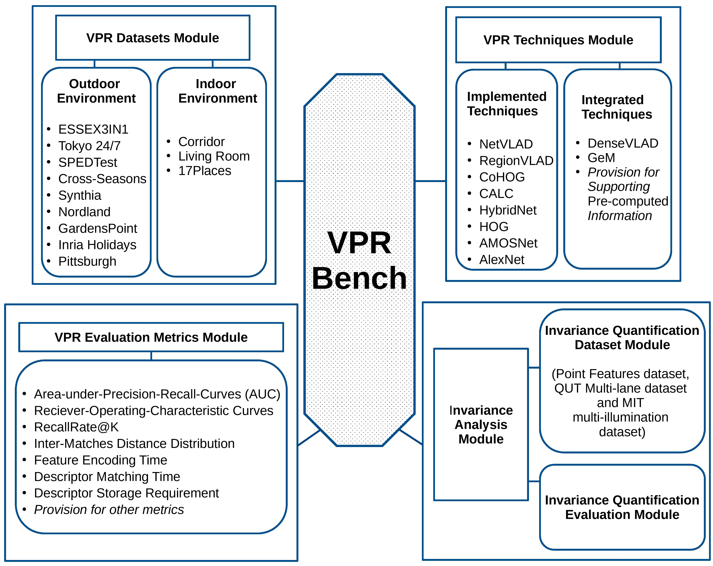

# VPR-Bench

## What is VPR-Bench

VPR-Bench is an open-source Visual Place Recognition evaluation framework with quantifiable viewpoint and illumination invariance. This repository represents the open-source release relating to our VPR-Bench paper published in the International Journal of Computer Vision, which you can access [here](https://doi.org/10.1007/s11263-021-01469-5). 


This repository allows you to do the following two things:

1. Compute the performance of 8 VPR techniques on 12 VPR datasets using multiple evaluation metrics, such as PR curves, ROC curves, RecallRate@N, True-Positive Distribution over a Trajectory etc.

2. Compute the quantified limits of viewpoint and illumination invariance of VPR techniques on Point Features dataset, QUT Multi-lane dataset and MIT Multi-illumination dataset.

### List of Techniques
1. NetVLAD [R. Arandjelović et al; https://arxiv.org/abs/1511.07247]
2. RegionVLAD [Khaliq et al; https://ieeexplore.ieee.org/document/8944012]
3. CoHOG [Zaffar et al; https://ieeexplore.ieee.org/document/8972582]
4. HOG [Dalal at al; OpenCV Implementation]
5. AlexNet [Krizhevsky et al; https://papers.nips.cc/paper/2012/file/c399862d3b9d6b76c8436e924a68c45b-Paper.pdf]
6. AMOSNet [Chen et al; https://ieeexplore.ieee.org/document/7989366]
7. HybridNet [Chen et al; https://ieeexplore.ieee.org/document/7989366]
8. CALC [Merrill et al; http://www.roboticsproceedings.org/rss14/p32.pdf]
9. DenseVLAD (Results-only) [Torii et al; https://ieeexplore.ieee.org/document/7298790]
10. AP-GeM (Results-only) [Revaud et al; https://ieeexplore.ieee.org/document/9010047]
### List of Datasets
1. ESSEX3IN1 [Zaffar et al; https://ieeexplore.ieee.org/document/9126220]
2. Tokyo24/7 [R. Arandjelović et al; https://arxiv.org/abs/1511.07247]
3. SPEDTest [Chen et al; https://ieeexplore.ieee.org/document/8421024]
4. Synthia [Ros et al; https://ieeexplore.ieee.org/document/7780721]
5. Nordland [Skrede et al; https://bit.ly/2QVBOym]
6. Gardens Point [Glover et al; https://doi.org/10.5281/zenodo.4590133]
7. INRIA Holidays [Jegou et al; https://lear.inrialpes.fr/pubs/2008/JDS08/jegou_hewgc08.pdf]
8. Pittsburgh Query [R. Arandjelović et al; https://arxiv.org/abs/1511.07247]
9. Cross-Seasons [Larsson et al; https://ieeexplore.ieee.org/document/8953253]
10. Corridor [Milford et al; https://journals.sagepub.com/doi/abs/10.1177/0278364913490323]
11. Living Room [Milford et al; https://ieeexplore.ieee.org/document/7487686]
12. 17 Places [Sahdev et al; https://ieeexplore.ieee.org/document/7801503]
 

Side Note: You can extend our codebase to include more datasets (or use full versions of some datasets) and techniques by following the templates described in the appendix of our paper. For further understanding these templates, dig into the 'VPR_techniques' and 'helper_functions' folders of this repository.

## Dependencies

Our code was written in Python 2, tested in Ubuntu 18.04 LTS and Ubuntu 20.04 LTS both using Anaconda Python. Please follow the below steps for installing dependencies:

1. Install Anaconda Python on your system (https://docs.anaconda.com/anaconda/install/). We are running conda 4.9.2 but other versions should also work.

2. Clone this VPR-Bench Github repository (using git clone).

```
git clone https://github.com/MubarizZaffar/VPR-Bench

```

3. Using 'cd' change your working directory to the downloaded VPR-Bench repository and execute the shell script 'must_downloads.sh'. This will download, extract and copy all the required model files and variation quantified datasets into their respective folders.

```
cd YOURDIR/VPR-Bench/
sh must_downloads.sh
```

4. This VPR-Bench repository also contains a YAML file named 'environment.yml'. Using this file, you can create a new conda environment (named 'myvprbenchenv') containing all the dependencies by running the following in your terminal.

```
conda env create -f environment.yml
```

5. There is a known Caffe bug regarding 'mean shape incompatible with input shape' , so follow the solution in https://stackoverflow.com/questions/30808735/error-when-using-classify-in-caffe. That is, modify the lines 253-254 in {USER}/anaconda3/envs/myvprbenchenv/lib/python2.7/site-packages/caffe.

6. Finally activate your environment using the following and you should be good to go.

```

conda activate myvprbenchenv

```

7. (Backup) If for some reason you are unable to create a conda environment from environment.yml, please look into the 'VPR_Bench_dependencies_installationcommands.txt' file in this repo, which specifies the individual commands needed to install the dependencies for VPR-Bench in a fresh Python 2 conda environment. A similar backup file namely 'must_downloads.txt' has also been provided for the 'must_downloads.sh' shell script.

## Using VPR-Bench

- After activating the 'myvprbenchenv' environment, execute the following in your terminal. This will compute the VPR performance of CoHOG and CALC on Corridor dataset while storing PR curves, matching information, RecallRate curves and others in respective sub-folders within the VPR-Bench folder (i.e. the downloaded Github repo).

```
python main.py -em 0 -sm 1 -dn Corridor -ddir datasets/corridor/ -mdir precomputed_matches/corridor/ -techs CoHOG CALC
```

- If you want to use any of the other 8 VPR techniques, modify the arguments in terminal accordingly e.g. to use all 8 VPR techniques, see below. 

```
python main.py -em 0 -sm 1 -dn Corridor -ddir datasets/corridor/ -mdir precomputed_matches/corridor/ -techs CoHOG CALC NetVLAD RegionVLAD AMOSNet HybridNet HOG AlexNet_VPR
```
- If you want to use any of the other 12 datasets in our work, download them from here (https://surfdrive.surf.nl/files/index.php/s/sbZRXzYe3l0v67W), and set the dataset fields (-dn and -ddir) accordingly.

- If you just want to use the matching data we had already computed for the 10 techniques on 12 datasets in our work, append '_Precomputed' to the name of a technique(s). This matching info is already available for corridor and SPEDTEST datasets in this repo, but for other datasets you would need to have downloaded this matching data (https://surfdrive.surf.nl/files/index.php/s/ThIgFycwwhRCVZv). Also set the dataset path via -ddir for access to ground-truth data. This ground-truth data is present for all datasets by default in the 'VPR-Bench/datasets/' folder. An example usage is given below.

```
python main.py -em 0 -sm 0 -dn SPEDTEST -ddir datasets/SPEDTEST/ -mdir precomputed_matches/SPEDTEST/ -techs CoHOG_Precomputed CALC_Precomputed NetVLAD_Precomputed RegionVLAD_Precomputed
```

- If you want to run the viewpoint and illumination invariance analysis of our work, change the 'VPR_evaluation_mode' (-em) in main.py to 1/2/3 (by default it is 0), to get this analysis on Point Features dataset, QUT Multi-lane dataset and MIT Multi-illumination dataset, respectively. Example execution is following.

```
python main.py -em 2 -techs NetVLAD RegionVLAD AMOSNet HybridNet CALC HOG CoHOG AlexNet_VPR

```

# Contacts
You can send an email at mubarizzaffar at gmail dot com, m dot zaffar at tudelft dot nl or s dot garg at qut dot edu dot au for further guidance and/or questions.

Important Note: For all the datasets and techniques, we have made our maximum effort to provide original citations and/or licenses within the respective folders, where possible and applicable. We request all users of VPR-Bench to be aware of (and use) the original citations and licenses in any of their works. If you have any concerns about this, please do send us an email.

# Cite as
If you find this work useful, please cite as:

```
@article{zaffar2021vpr,
  title={Vpr-bench: An open-source visual place recognition evaluation framework with quantifiable viewpoint and appearance change},
  author={Zaffar, Mubariz and Garg, Sourav and Milford, Michael and Kooij, Julian and Flynn, David and McDonald-Maier, Klaus and Ehsan, Shoaib},
  journal={International Journal of Computer Vision},
  pages={1--39},
  year={2021},
  publisher={Springer}
}
```
